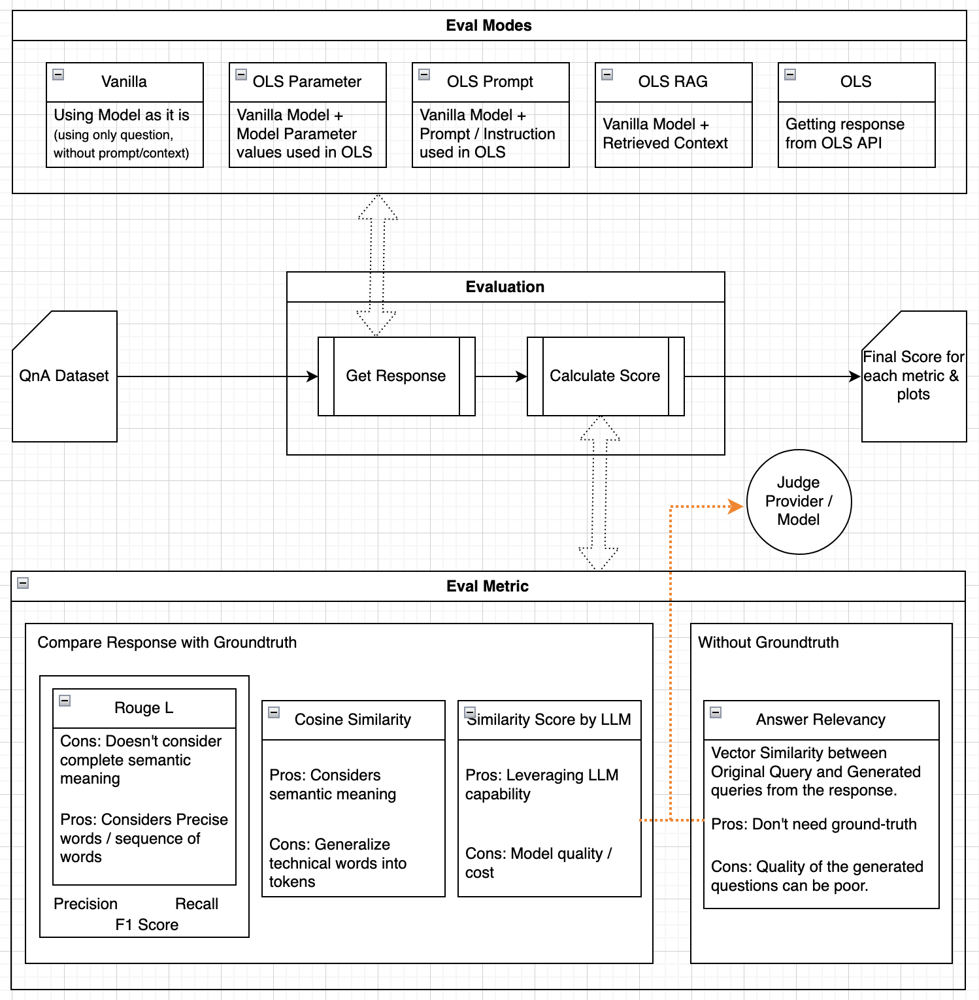

# Lightspeed Core Evaluation
Evaluation tooling for lightspeed-core project

## Installation
- **Requires Python 3.11**
- Install `uv`
- Check `uv --version` is working
- If running Python 3.11 from `venv`, make sure no conflicting packages are installed. In case of problems create a clean venv for Python 3.11 and `uv`.
- Run `uv sync`
- Optional: For development, run `make install-tools`
    + if `uv` is not installed this will install `uv` by running `pip install uv` in your current Python environment.


## Description
Currently we have 2 types of evaluations.
1. `consistency`: Ability to compare responses against ground-truth answer for specific provider+model. Objective of this evaluation is to flag any variation in specific provider+model response. Currently a combination of similarity distances are used to calculate final score. Cut-off scores are used to flag any deviations. This also stores a .csv file with query, pre-defined answer, API response & score. Input for this is a [json file](eval_data/question_answer_pair.json)

2. `model`: Ability to compare responses against single ground-truth answer. Here we can do evaluation for more than one provider+model at a time. This creates a json file as summary report with scores (f1-score) for each provider+model. Along with selected QnAs from above json file, we can also provide additional QnAs using a parquet file (optional). [Sample QnA set (parquet)](eval_data/interview_qna_30_per_title.parquet) with 30 queries per OCP documentation title.

    

**Notes**
- QnAs should `not` be used for model training or tuning. This is created only for evaluation purpose.
- QnAs were generated from OCP docs by LLMs. It is possible that some of the questions/answers are not entirely correct. We are constantly trying to verify both Questions & Answers manually. If you find any QnA pair to be modified or removed, please create a PR.
- OLS API should be ready/live with all the required provider+model configured.
- It is possible that we want to run both consistency and model evaluation together. To avoid multiple API calls for same query, *model* evaluation first checks .csv file generated by *consistency* evaluation. If response is not present in csv file, then only we call API to get the response.

### e2e test case

These evaluations are also part of **e2e test cases**. Currently *consistency* evaluation is parimarily used to gate PRs. Final e2e suite will also invoke *model* evaluation which will use .csv files generated by earlier suites, if any file is not present then last suite will fail.

### Usage
```
uv run evaluate
```

### Input Data/QnA pool
[Json file](eval_data/question_answer_pair.json)

[Sample QnA set (parquet)](eval_data/interview_qna_30_per_title.parquet)

Please refer above files for the structure, add new data accordingly.

### Arguments
**eval_type**: This will control which evaluation, we want to do. Currently we have 3 options.
1. `consistency` -> Compares model specific answer for QnAs provided in json file
2. `model` -> Compares set of models based on their response and generates a summary report. For this we can provide additional QnAs in parquet format, along with json file.
3. `all` -> Both of the above evaluations.

**eval_api_url**: OLS API url. Default is `http://localhost:8080`. If deployed in a cluster, then pass cluster API url.

**eval_api_token_file**: Path to a text file containing OLS API token. Required, if OLS is deployed in cluster.

**eval_scenario**: This is primarily required to indetify which pre-defined answers need to be compared. Values can be `with_rag`, `without_rag`. Currently we always do evaluation for the API with rag.

**eval_query_ids**: Option to give set of query ids for evaluation. By default all queries are processed.

**eval_provider_model_id**: We can provide set of provider/model combinations as ids for comparison.

**qna_pool_file**: Applicable only for `model` evaluation. Provide file path to the parquet file having additional QnAs. Default is None.

**eval_out_dir**: Directory, where output csv/json files will be saved.

**eval_metrics**: By default all scores/metrics are calculated, but this decides which scores will be used to create the graph.
This is a list of metrics. Ex: cosine, euclidean distance, precision/recall/F1 score, answer relevancy score, LLM based similarity score.

**judge_provider / judge_model**: Provider / Model for judge LLM. This is required for LLM based evaluation (answer relevancy score, LLM based similarity score). This needs to be configured correctly through config yaml file. [Sample provider/model configuration](../../examples/olsconfig.yaml)

**eval_modes**: Apart from OLS api, we may want to evaluate vanilla model or with just OLS paramaters/prompt/RAG so that we can have baseline score. This is a list of modes. Ex: vanilla, ols_param, ols_prompt, ols_rag, & ols (actual api).

### Outputs
Evaluation scripts creates below files.
- CSV file with response for given provider/model & modes.
- response evaluation result with scores (for consistency check).
- Final csv file with all results, json score summary & graph (for model evaluation)

[Evaluation Result](eval_data/result/README.md)

## Agent Evaluation
For a detailed walkthrough of the new agent-evaluation framework, refer
[lsc_agent_eval/README.md](lsc_agent_eval/README.md)

## RAG retrieval script
```
python -m scripts.evaluation.query_rag
```
This is used to generate a .csv file having retrieved chunks for given set of queries with similarity score. This is not part of actual evaluation. But useful to do a spot check to understand the text that we send to LLMs as context (this may explain any deviation in the response)

#### Arguments
*db-path*: Path to the RAG index

*product-index*: RAG index ID

*model-path*: Path or name of the embedding model

*queries*: Set of queries separated by space. If not passed default queries are used.

*top-k*: How many chunks we want to retrieve. Default is 10.

*output_dir*: To save the .csv file.